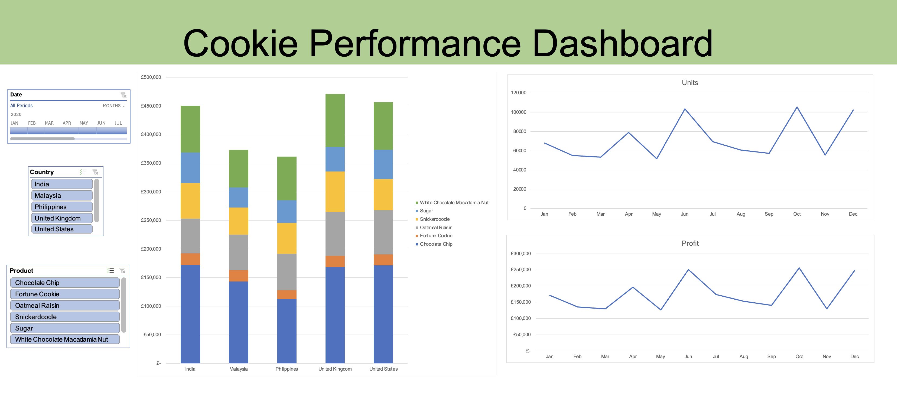

# Excel-Project-Cookie-Sales

# 🍪 Cookie Sales Dashboard

## 📚 Project Overview
This project focuses on building an **interactive sales performance dashboard in Microsoft Excel** to analyze key business metrics such as **profit, unit sales, and trends over time**.  
The dashboard is fully dynamic and updates automatically as new data is added—without using VBA or add-ins.

---

## 📊 Dashboard Preview

---

## 🎯 Project Objectives
- Create a clean, executive-friendly dashboard for sales performance monitoring  
- Enable quick insights into **profitability, sales volume, and trends**  
- Allow users to interact with data using slicers and timelines  
- Ensure the dashboard automatically updates when new data is added  

---

## 💡 Key Features
- **Profit by Market & Product** – Stacked column chart comparing profitability across regions and products  
- **Units Sold Over Time** – Line chart showing monthly sales trends  
- **Profit Over Time** – Monthly profit trend analysis  
- **Interactive Filtering**:
  - Country slicer  
  - Product slicer  
  - Date timeline (month & year)
- **Auto-Refreshing Dashboard** – New data is incorporated instantly via Excel Tables  

---

## 🛠 How I Built This Project
1. **Data Preparation** – Converted raw sales data into an **Excel Table** for scalability and automatic refresh  
2. **Data Modeling** – Built multiple **Pivot Tables** to summarize profit and unit sales by time, country, and product  
3. **Analysis** – Sorted and formatted data to highlight top-performing markets and products  
4. **Visualization** – Created Pivot Charts (stacked column and line charts) and removed clutter for clarity  
5. **Interactivity** – Added **slicers and a timeline**, connected across all Pivot Tables  
6. **Dashboard Design** – Removed gridlines, aligned visuals, and applied clean formatting  

---

## 🛠 Tools & Techniques Used
- Microsoft Excel  
- Excel Tables  
- Pivot Tables & Pivot Charts  
- Slicers & Timelines  
- Dashboard layout & design  

---

## 🚀 Key Takeaways
- Built a **fully interactive Excel dashboard** using only native Excel features  
- Designed a scalable solution that updates automatically with new data  
- Delivered a clear, stakeholder-friendly dashboard for sales insights 
